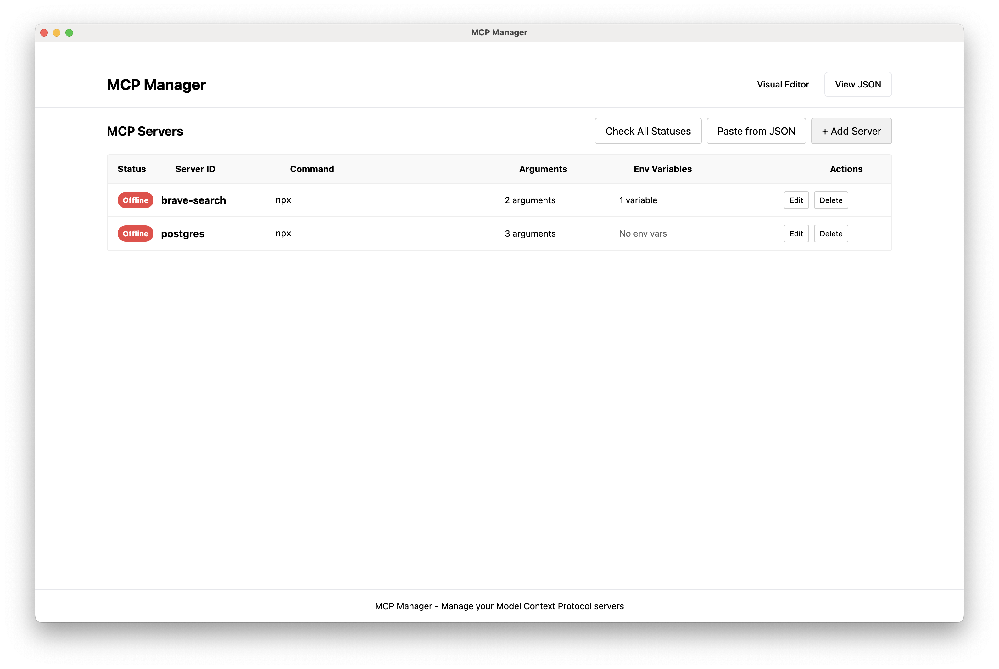

# MCP Manager

MCP Manager is an Electron-based desktop application for managing Model Context Protocol (MCP) servers. It provides an intuitive graphical interface to configure, monitor, and manage MCP servers with ease.



## Features


- 🖥️ **Visual Server Management**: Add, edit, and remove MCP servers through a user-friendly interface.
- 🔄 **Real-time Status Monitoring**: Check the status of your servers with one click.
- 🛠️ **Advanced Configuration**: Customize command, arguments, and environment variables for each server.
- 📋 **JSON Import/Export**: Import and export server configurations in JSON format.
- 🔍 **Direct JSON Editing**: View and edit the raw configuration file if needed.
- 🎨 **Modern UI**: Sleek, responsive interface with light and dark mode support.
- 🧩 **Component-Based Architecture**: Modular design for easy maintenance and extensibility.

## UI Features

- 🌓 **Theme Switching**: Toggle between light, dark, and system themes.
- 🎭 **Smooth Transitions**: Animated transitions between views for a polished user experience.
- 📱 **Responsive Design**: Adapts to different screen sizes and resolutions.
- 🧠 **Intuitive UX**: Clear visual hierarchy and interactive elements for better usability.
- 🛠️ **Tooltips and Helpers**: Contextual information to guide users through the application.

## Technology Stack

- **Frontend Framework**: [React](https://reactjs.org/) with [TypeScript](https://www.typescriptlang.org/)
- **UI Component Library**: [Mantine](https://mantine.dev/) for modern, accessible components
- **Icons**: [Tabler Icons](https://tabler-icons.io/) for consistent, clean iconography
- **Desktop Framework**: [Electron](https://www.electronjs.org/) for cross-platform compatibility
- **Build System**: [Vite](https://vitejs.dev/) for fast development and optimized builds

## Installation

### Direct Download

You can download the latest pre-built application for your platform:

- [macOS (DMG)](https://github.com/timetime-software/mcp-manager/raw/main/release/MCP%20Manager-1.0.0.dmg)
- [macOS (ZIP)](https://github.com/timetime-software/mcp-manager/raw/main/release/MCP%20Manager-1.0.0-mac.zip)

### Building from Source

If you prefer to build the application yourself:

1. Clone the repository:

   ```bash
   git clone https://github.com/iagolast/mcp-manager.git
   cd mcp-manager
   ```

2. Install dependencies:

   ```bash
   npm install
   ```

3. Build the application:

   ```bash
   npm run build
   ```

4. Create distributables:
   ```bash
   npm run dist
   ```

The built application will be available in the `release` directory.

## Development

### Running in Development Mode

1. Clone the repository and install dependencies:

   ```bash
   git clone https://github.com/iagolast/mcp-manager.git
   cd mcp-manager
   npm install
   ```

2. Start the development server:
   ```bash
   npm run dev
   ```

This will launch both the Vite development server for the React frontend and the Electron application.

### Project Structure

- `src/renderer`: React application code (UI components)
- `src/renderer/components`: React components organized by feature
- `src/renderer/services`: Services for managing configuration and server communication
- `src/renderer/types`: TypeScript type definitions
- `electron`: Electron main process code

### UI Components

The application uses a component-based architecture with Mantine UI:

- **AppShell**: Main layout container with header, footer, and content areas
- **ServerManager**: Central component for managing MCP servers
- **ServerCard**: Individual server display with status and actions
- **ServerDialog**: Form for adding and editing servers
- **DeleteConfirmDialog**: Confirmation dialog for server deletion
- **ImportJsonDialog**: Dialog for importing server configurations from JSON

### Testing

Run the tests with:

```bash
npm test
```

For development with continuous testing:

```bash
npm run test:watch
```

## Configuration

MCP Manager stores its configuration in:

- macOS: `~/Library/Application Support/Claude/claude_desktop_config.json`
- Windows: `%APPDATA%\Claude\claude_desktop_config.json`
- Linux: `~/.config/Claude/claude_desktop_config.json`

## Contributing

Contributions are welcome! Please feel free to submit a Pull Request.

1. Fork the repository
2. Create your feature branch: `git checkout -b feature/amazing-feature`
3. Commit your changes: `git commit -m 'Add some amazing feature'`
4. Push to the branch: `git push origin feature/amazing-feature`
5. Open a Pull Request

## License

This project is licensed under the MIT License - see the [LICENSE](LICENSE) file for details.

## Acknowledgements

- Built with [Electron](https://www.electronjs.org/)
- Frontend developed with [React](https://reactjs.org/) and [TypeScript](https://www.typescriptlang.org/)
- UI components from [Mantine](https://mantine.dev/)
- Icons from [Tabler Icons](https://tabler-icons.io/)
- Build system powered by [Vite](https://vitejs.dev/)
